### Шаги воспроизведения:
1. Перейти по ссылке https://www.avito.ru/
2. Выбрать категорию "Хобби и отдых" -> "Велосипеды" -> "Горные"
3. В боковом меню выбрать фильтры "Бренд" Author, указать цену до 90000
4. Нажать на кнопку "Показать ... объявлений"

### Шаги воспроизведения аналогичны для всех багов, кроме бага 5

## 1. Сообщение об ошибке при корректных результатах поиска

Описание:
При выполнении поиска с корректными параметрами отображается сообщение об ошибке, хотя товары успешно загружаются.

Приоритет:
high (сообщение об ошибке при корректных результатах поиска, вводит пользователя в заблуждение о достоверности
отображаемой информации)

Критичность:
Critical

Ожидаемый результат:
Отображаются карточки с товарами велосипедов, окно с сообщением об ошибке отсутствует

Фактический результат:
Отображаются карточки с товарами велосипедов, окно с сообщением "Попробуйте обновить страницу или
загляните позже - мы обязательно все починим."

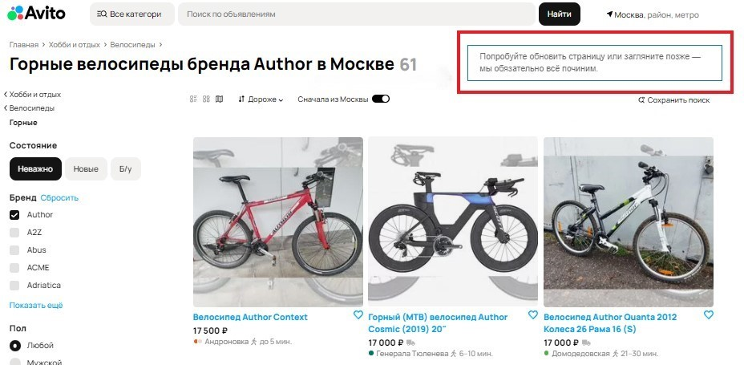

## 2. Не отображается параметр "Радиус" в окне местоположения

Описание: При выборе местоположения с ПК отсутствует параметр "Радиус", в то время как на ноутбуке и телефоне
он отображается.

Приоритет:
low (параметр "Радиус" не отображается в окне местоположения, но возможность настроить радиус поиска присутствует)

Критичность:
Minor

Ожидаемый результат:
В окне местоположения отображается Москва, район, метро, радиус
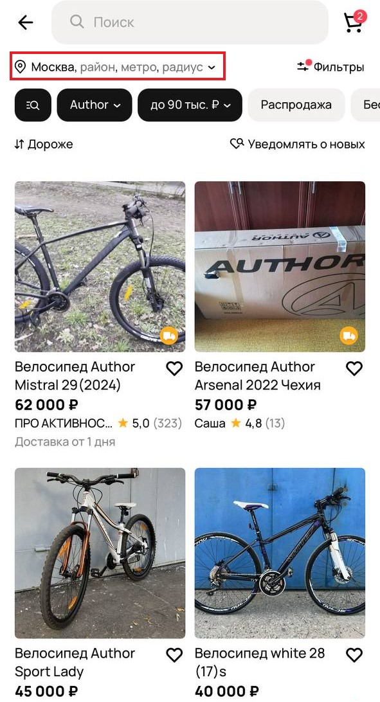
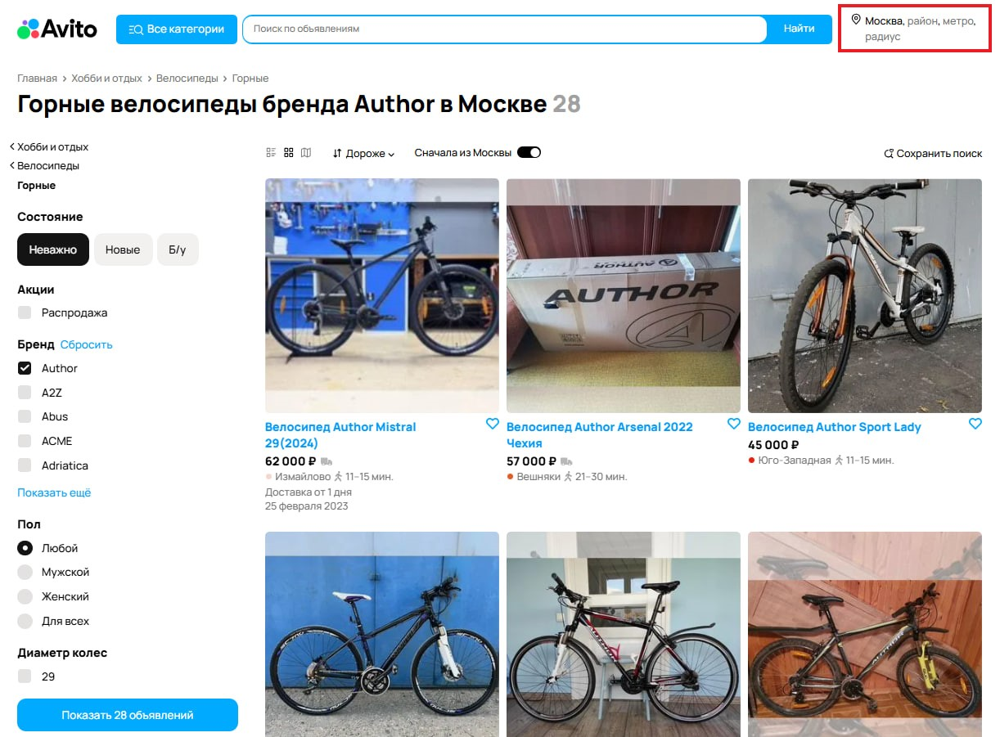

Фактический результат:
В окне местоположения отображается Москва, район, метро

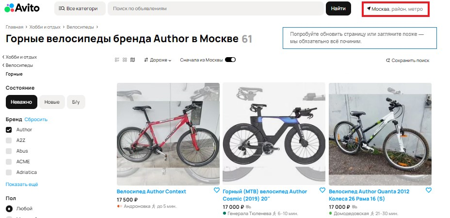

## 3. Не выполняется сортировка по цене "Дороже"

Описание: При выборе сортировки "Дороже" сначала корректно отображаются более дорогие товары, но затем
порядок нарушается.

Приоритет:
high (пользователь может приобрести товар, который не соответствует его ожиданиям по цене)

Критичность:
Major

Ожидаемый результат:
Цены отображаются в порядке убывания, с самой большой

Фактический результат:
Первые шесть объявлений отображаются в порядке убывания, цена оставшихся объявлений
выше первых шести

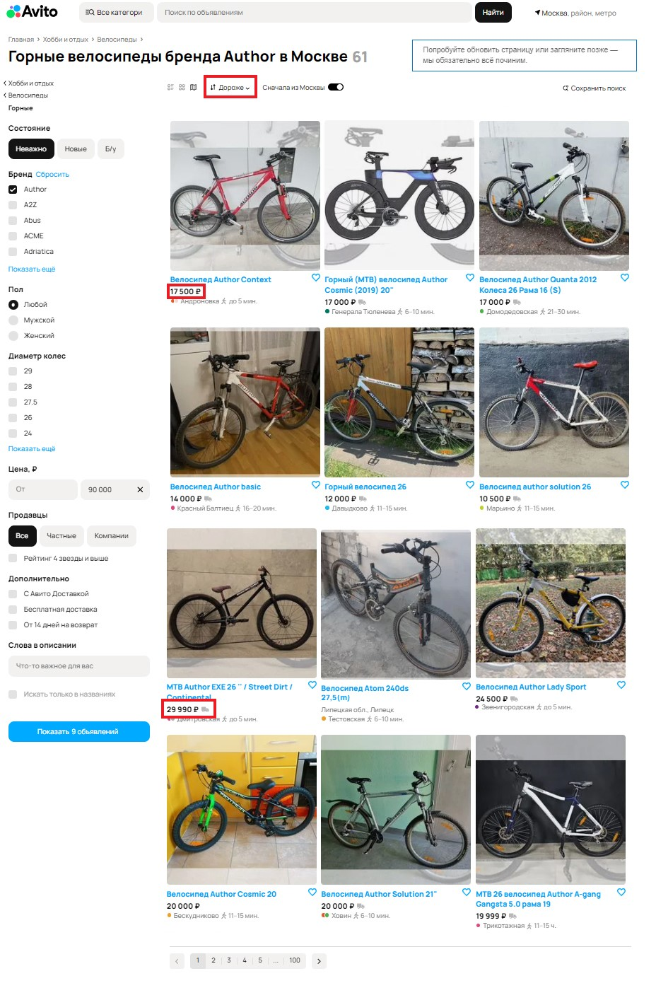

## 4. Неполный путь в элементе "Хлебные крошки"

Описание: В элементе "Хлебные крошки" отсутствует указание категории "Горные".

Приоритет:
low (в элементе не отображается категоряи "Горные", но пользователь просматривает товары выбранной категории)

Критичность:
Minor

Ожидаемый результат:
"Хлебные крошки" выглядят следующим образом:
Главная > Хобби и отдых > Велосипеды > Горные

Фактический результат:
"Хлебные крошки" выглядят следующим образом:
Главная > Хобби и отдых > Велосипеды

## 5. При выборе radio button "Карта с товарами" отображаются товары в виде плиток

Описание: При переключении на "Карта с товарами" вместо карты остаются карточки товаров.

Приоритет:
high (у пользователя нет наглядного просмотра товара на географической карте)

Критичность:
Major

Шаги воспроизведения:
1. Перейти по ссылке https://www.avito.ru/
2. Выбрать категорию "Хобби и отдых" -> "Велосипеды" -> "Горные"
3. В боковом меню выбрать фильтры "Бренд" Author, указать цену до 90000
4. Нажать на кнопку "Показать ... объявлений"
5. Выбрать radio button "Карта с товарами"

Ожидаемый результат:
Отображение карты выбранной локации с товарами

Фактический результат:
Отображаются товары в виде плиток

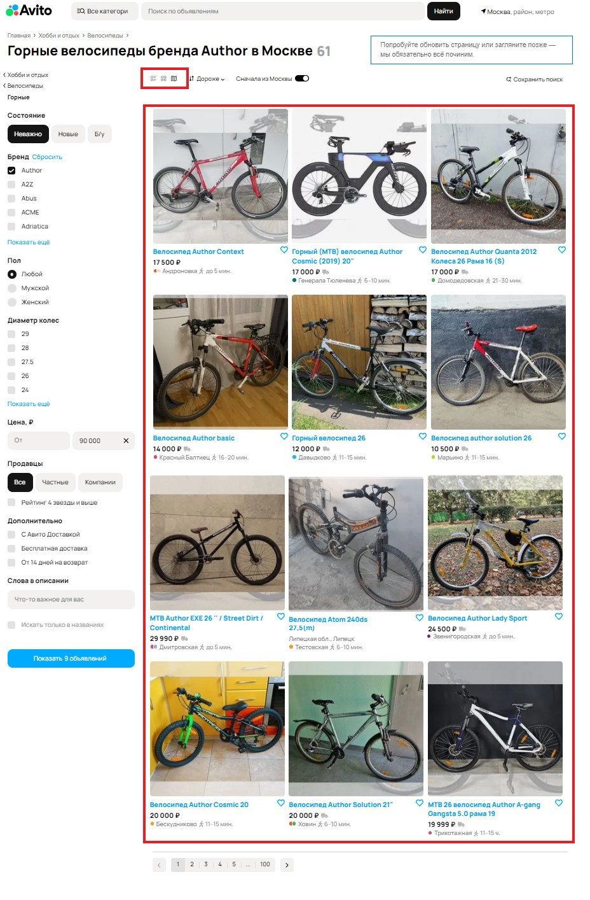

## 6. Разное количество товаров в заголовке и кнопке "Показать ... объявлений"

Описание: Число товаров в заголовке отличается от числа в кнопке "Показать ... объявлений".

Приоритет:
low(пользователь ожидает увидеть меньше объявлений, чем есть в заголовке и в результатах поиска)

Критичность:
Minor

Ожидаемый результат:
Количество товаров в заголовке такое же как и в кнопке "Показать ... объявлений":
Горные велосипеды бренда Author в Москве 61
"Показать 61 объявление"

Фактический результат:
Количество товаров в заголовке отличается от количества товаров в кнопке "Показать ... объявлений":
Горные велосипеды бренда Author в Москве 61
"Показать 9 объявлений"

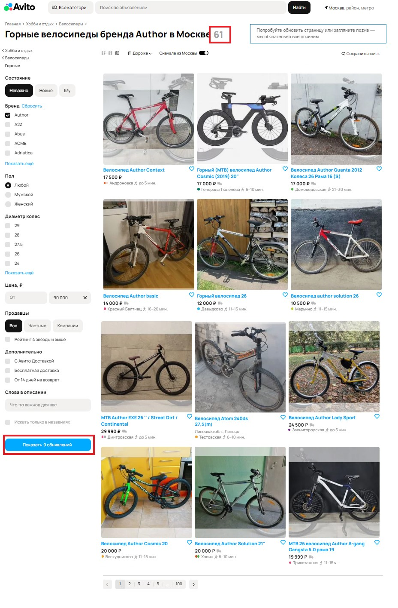

## 7. Некорректное отображение города в карточке товара
   
Описание: В результатах поиска отображается товар из Липецка, хотя фильтр настроен на Москву.

Приоритет:
high(пользователь ожидает видеть товары только из указанного им города)

Критичность:
Major

Ожидаемый результат:
Товар "Велосипед Atom 240ds 27,5(m)" не отображается на странице

Фактический результат:
Для товара "Велосипед Atom 240ds 27,5(m)" отображается регион "Липецкая обл., Липецк"

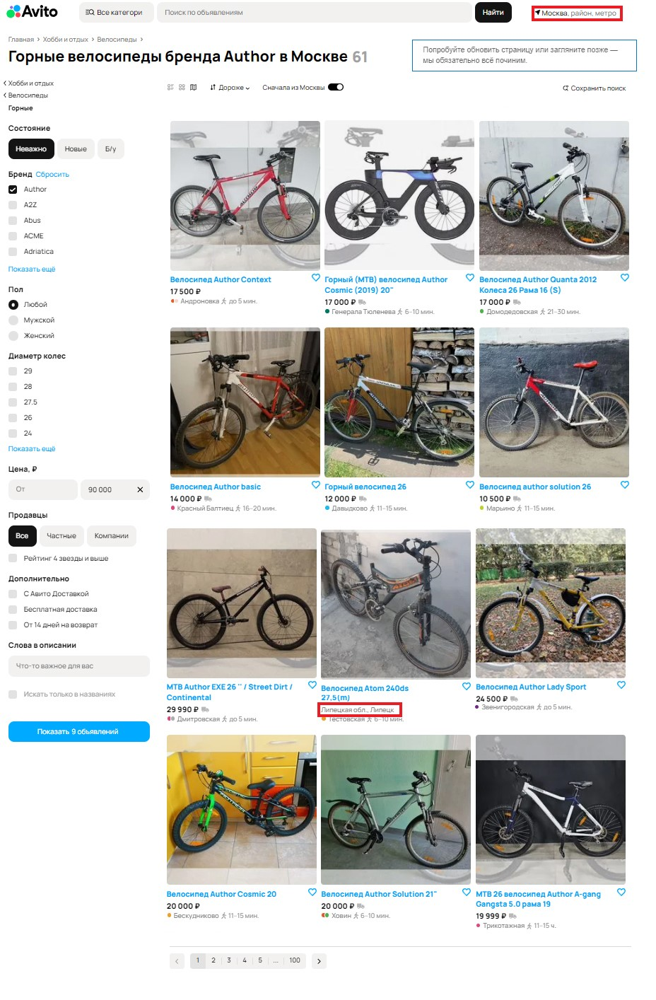

## 8. Опечатка в станции метро "Ховрино"
   
Описание: В интерфейсе станция "Ховрино" указана как "Ховин".

Приоритет:
low(опечатка в названии, но местоположение определено верно)

Критичность:
Minor

Ожидаемый результат:
Станция метро имеет название "Ховрино"

Фактический результат:
Станция метро имеет название "Ховин"

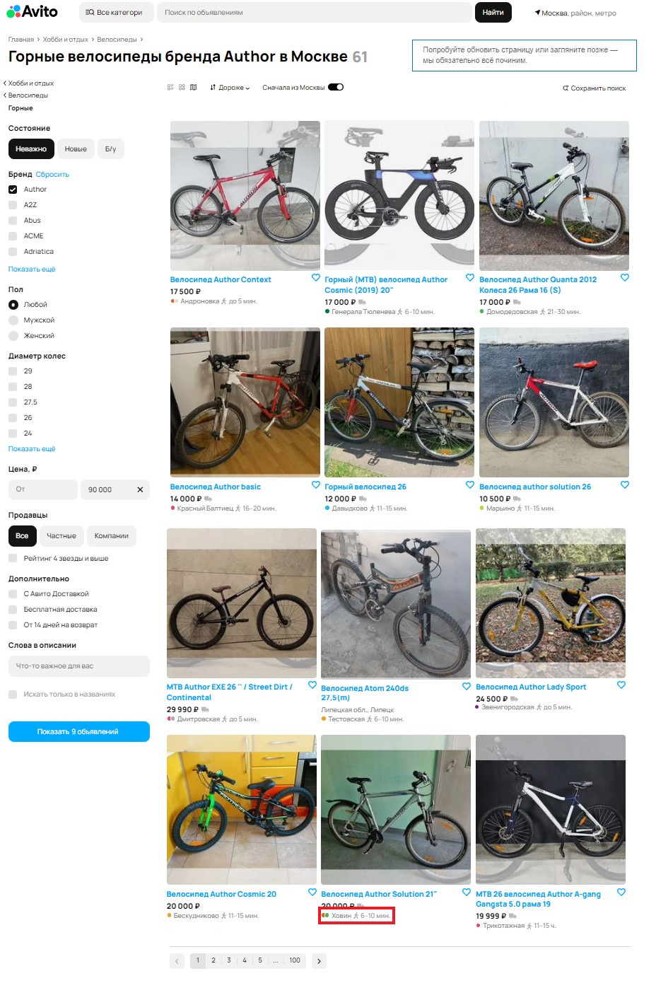

## 9. Отображение станции метро другого города в результатах поиска
   
Описание: В результатах поиска для товаров из Москвы встречается товар с метро Санкт-Петербурга.

Приоритет:
high(пользователь ожидает видеть товары только из указанного им города)

Критичность:
Major

Ожидаемый результат:
Товар "Велосипед Author Lady Sport" не отображается на странице

Фактический результат:
В результатах поиска присутствует товар "Велосипед Author Lady Sport" со станцией метро "Звенигородская" 
(Санкт-Петербург)

## 10. Некорректое отображение пагинации в результатах поиска

Описание: Количество страниц в пагинации некорректно рассчитывается (отображается 100 страниц вместо ожидаемых 6).

Приоритет:
medium(пользователь ожидает увидеть 100 страниц с товарами, но скорее всего получит сообщение об ошибке)

Критичность:
Major

Ожидаемый результат:
Пагинация внизу страницы рассчитывается корректно(если товаров 61, то страниц 6)

Фактический результат:
Пагинация 100 страниц

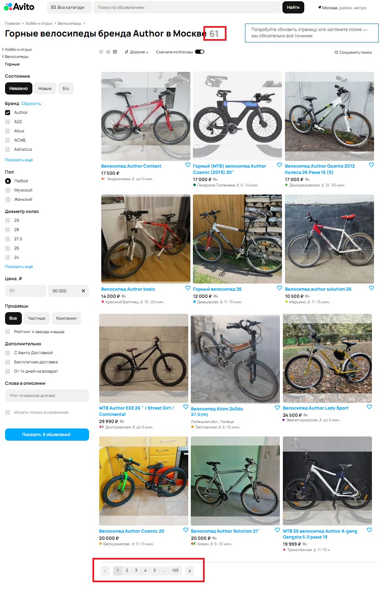

## 11. Отображение велосипеда другого бренда

Описание: В результатах поиска встречается товар, который не соответствует выбранному бренду

Приоритет: medium(пользователь ожидает увидеть товары выбранного бренда)

Критичность: Major

Ожидаемый результат:
В результатах поиска присутствуют только велосипеды бренда "Author", велосипеды других брендов не отображаются

Фактический результат:
В результатах поиска присутствует товар "Велосипед Atom 240ds 27,5(m)" бренда "Atom"

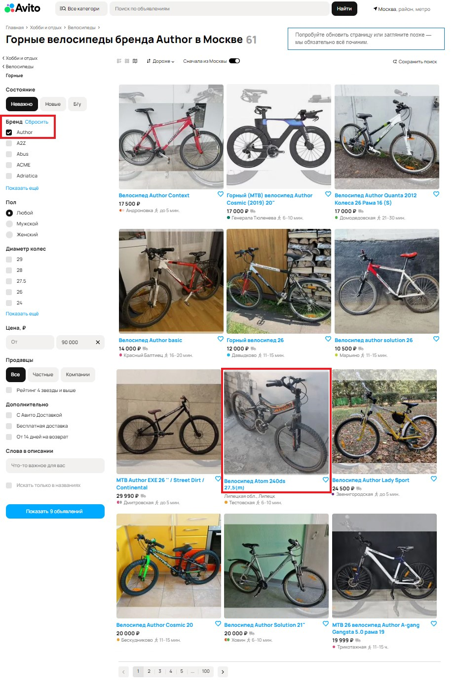

## 12. Некорректное отображение пешего времени от станции метро до продавца

Описание: Время пешего маршрута отображается в часах вместо минут.
Приоритет:
medium(пользователь ожидает увидеть время от метро в минутах, время в часах может оттолкнуть пользователя от покупки)

Критичность:
Major

Ожидаемый результат:
У товара "MTB 26 велосипед Author A-gang Gangsta 5.0 рама 19" пешее время отображается в минутах
11 - 15 мин.

Фактический результат:
У товара "MTB 26 велосипед Author A-gang Gangsta 5.0 рама 19" пешее время отображается в часах
11 - 15 ч.

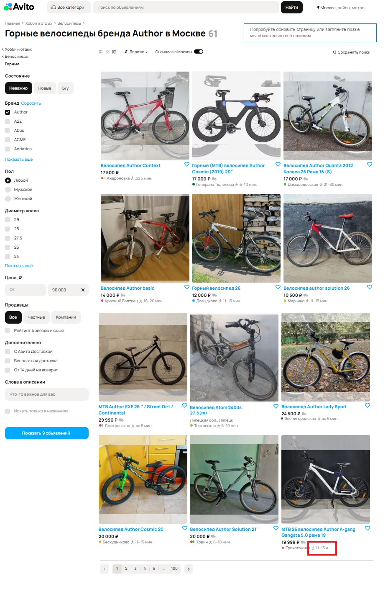

## 13. Отсутствие фильтров "Акции" и "Тип рамы"

Описание: В боковом меню поиска отсутствуют фильтры, которые должны быть доступны.

Ожидаемый результат описан на осное актуальной версии сайта

Приоритет:
medium(у пользователя нет возможности настроить поиск по конкретным фильтрам, при этом он может воспользоваться
другими фильтрами и просматривать товары)

Критичность: Major

Ожидаемый результат:
Фильтры "Акции" и "Тип рамы" отображаются в боковом меню и доступны к выбору

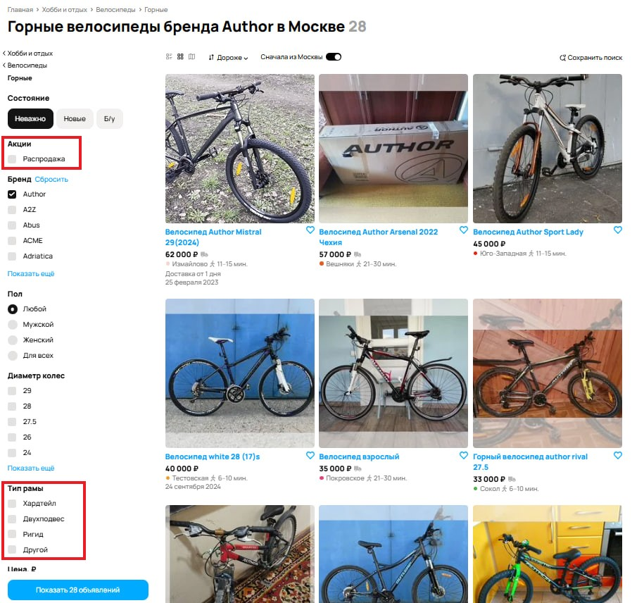

Фактический результат:
Фильтры "Акции" и "Тип рамы" отсутствуют в боковом меню

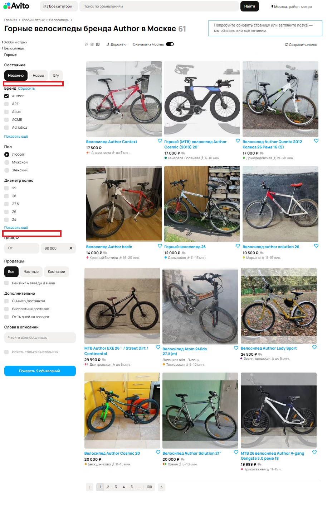

## 14. Отсутствие цены в карточке товара
    
Описание: В карточке товара отсутствует цена.

Приоритет:
high(пользователь ожидает увидеть цену товара перед его просмотром)

Критичность: Major

Ожидаемый результат:
Для товара "Велосипед Atom 240ds 27,5(m)" отображается цена приобритения

Фактический результат:
Для товара "Велосипед Atom 240ds 27,5(m)" цена приобритения не отображается

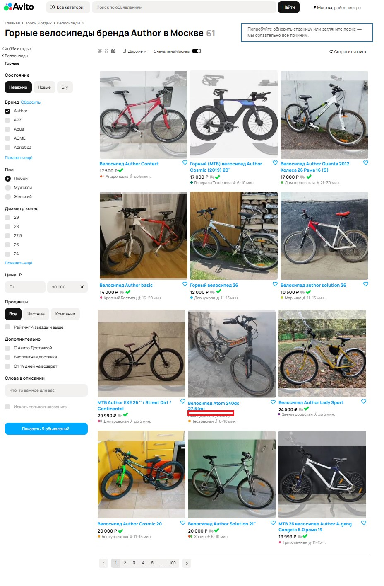

## 15. Товару из региона присвоена станция московского метро
    
Описание: В карточке товара из Липецкой области указана станция метро "Тестовская", хотя в регионе 
метро отсутствует.

Приоритет:
medium(пользователь ищет товар в Москве, может увидеть объявление из другого города, но из-за наличия метро ошибочно 
решить, что товар находится в Москве)

Критичность: Major

Ожидаемый результат:
У товаров из регионов, где нет метро, не должно быть указано метро.

Фактический результат:
У товара из Липецкой области указана станция метро "Тестовская".

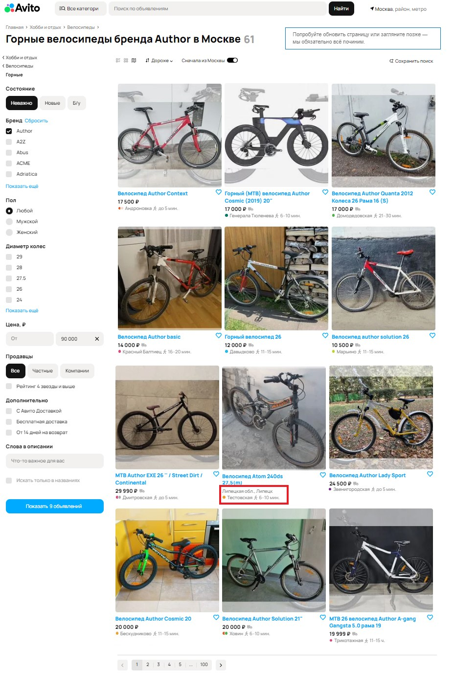

## 16. Некорректное наименование кнопки "Все категории"

Описание: В интерфейсе кнопка "Все категории" указана как "Все категори".

Приоритет: low (опечатка)

Критичность: Minor

Ожидаемый результат: Наименование кнопки "Все категории"

Фактический результат: Наименование кнопки "Все категори"

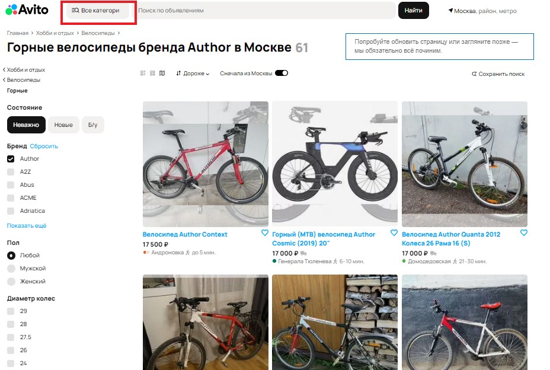
